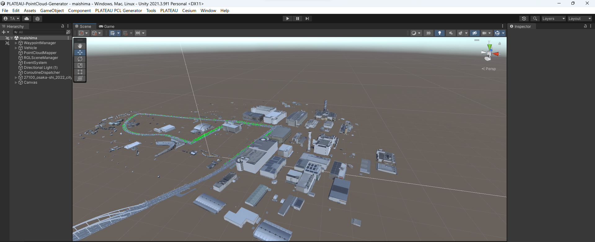

# サンプルシーン実行手順

## 1. サンプルシーンを開く
- プロジェクトから`maishima.unity`シーンを開きます。
- サンプルシーンは大阪府大阪市舞洲地区の3D都市モデルを配置した`maishima.unity`と神奈川県横浜市みなとみらい地区を配置した`minatomirai.unity`シーンの2つのサンプルシーンを用意しています。
- サンプルシーンに配置したモデルには、テクスチャを含んでいません。（githubへのアップロード容量制限のため）

- UnityHubにてプロジェクトを開きます。
 

- `Assets/SampleScene`内の`maishima.unity`を開きます。
 

- サンプルシーンを開いた画面
 

## 2. 仮想車両の走行
- UnityシーンのPlayボタンを押すと、仮想車両が走行を開始します。
- サンプルシーンには予めルートを設定しています。
 

- サンプルシーン走行の様子
 

## 3. 点群マップ出力
- 走行終了後、`Assets/pcd`フォルダに点群マップが出力されます。
 

## 4. 点群マップの確認
- CloudCompareなどの点群ビュワーソフトを利用し、点群マップを確認します。
 
