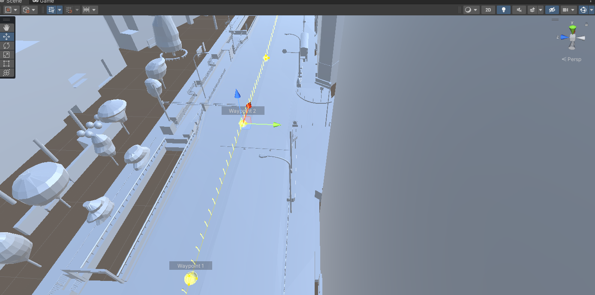

# ルート設定

## 1. PLATEAU PCL Generatorメニューを開く
- メニューバーの`PLATEAU PCL Generator`をクリックして、`Waypoint設定`をクリックします。
 

## 2. ルート名を設定
- ルート名を入力します
 

## 3. パス作成開始
- パス作成開始ボタンをクリックします。
- シーン上で`Pキー`を押すことで、Waypointオブジェクトを配置できます。
 

## 4. パス作成終了、パス設定
- パス作成を終了ボタンをクリックすると、走行ルートが表示されます。
- パス設定をクリックすると、車両の走行ルートを設定します。

 

## 5. Waypoint編集
- Waypointオブジェクトの位置を調整することで、Waypointの微調整を行うことができます。
 
